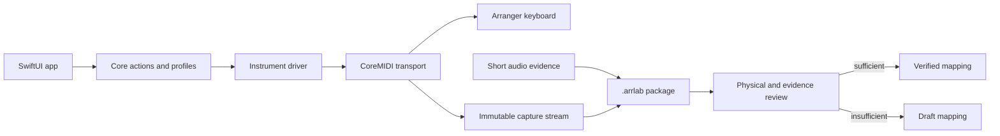

# Architecture and trust boundaries

Arranger Lab separates musical intent, instrument-specific compilation,
transport and evidence so that a convenient UI cannot silently bypass safety.

## Modules

- `ArrangerLabCore` owns domain models, validation, instrument profiles, the
  PA700 driver, parsers, capture packages, diffs and exports. It does not own a
  live CoreMIDI client.
- `ArrangerLabMIDI` owns endpoint discovery, hot-plug, bounded decoding,
  scheduled sends, replay, clock and Panic lifecycle behavior.
- `ArrangerLabAudio` records short, explicitly requested WAV evidence and
  computes deterministic measurements.
- `ArrangerLabApp` owns presentation and user confirmation. It cannot promote a
  Draft mapping by itself.
- `ArrangerLabTestHarness` exercises cross-module behavior without depending on
  XCTest or connected hardware.

## Important trust boundaries

### MIDI input and output

Endpoint names locate candidates; an explicit protocol identity response
confirms the instrument. Incoming streams are decoded with bounded SysEx state.
Operational actions compile through the driver, while raw SysEx remains behind
expiring Expert mode and explicit confirmation.

### Files and packages

`.arrlab` packages preserve raw events and use normalized data only for
presentation and comparison. Publishing validates paths and stages output
before an atomic move. The media inventory refuses symbolic-link traversal and
exports no absolute paths or file contents.

### PDFs and charts

The file picker grants temporary access to a selected PDF. Import enforces a
32 MiB file limit, 256-page limit and 4 MiB extracted-text limit, checks for
cancellation and performs PDFKit parsing outside the main UI executor. Only the
derived local chart is persisted.

### Evidence state

`Draft` means a mapping may be explored in Laboratory mode. `Verified` requires
the evidence defined in [CONTEXT.md](../CONTEXT.md). Applied or observed device
state is not itself evidence of correctness.
