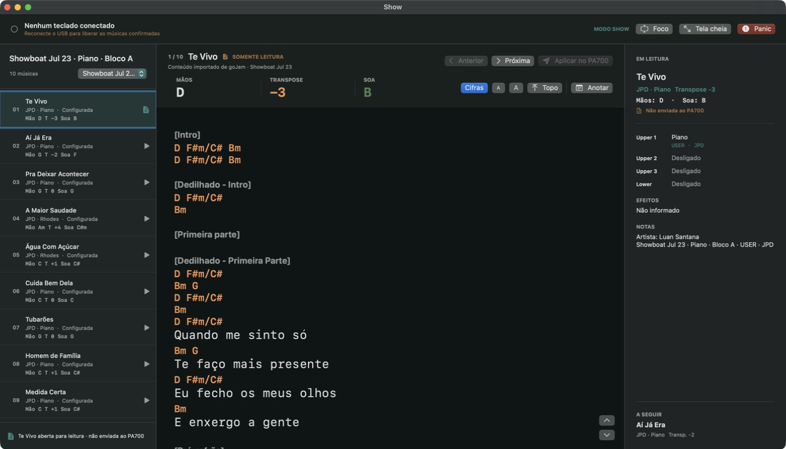
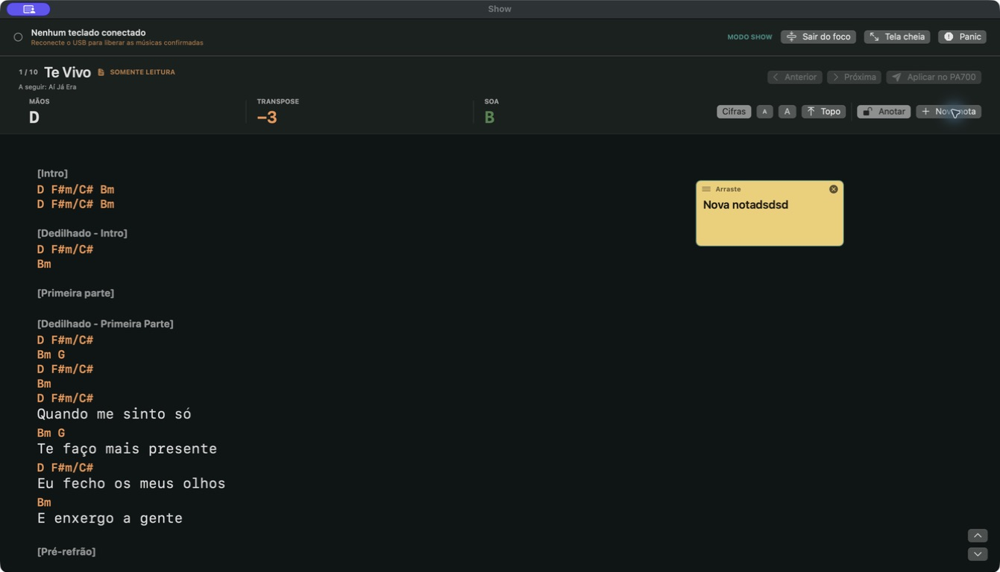
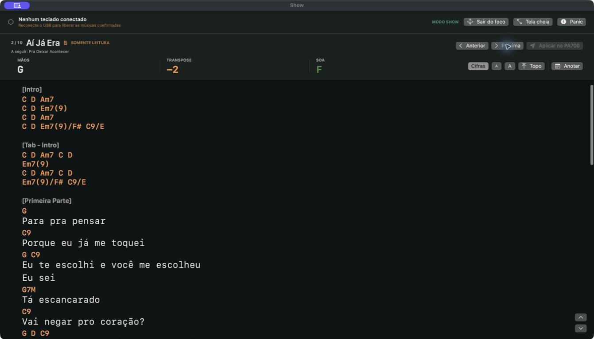
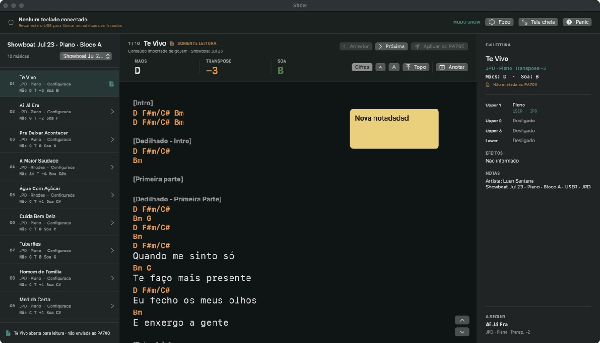
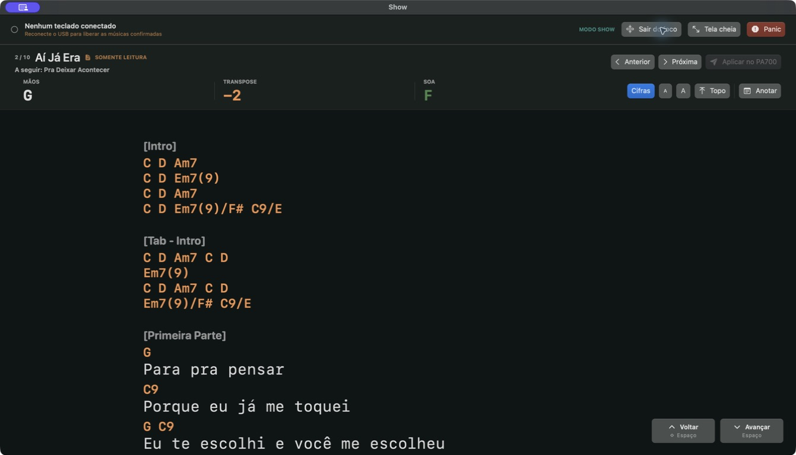

# Performance experience audit: 2026-07-20

## Scope

Combined UX and accessibility audit of the signed macOS Show experience: entering the show, concentrating on the chart, editing a stage note and moving to the next song.

The performer may be under changing light, standing away from the screen and using one hand for the instrument. The target is fast recognition, large recovery controls, safe MIDI behavior and reliable keyboard operation.

## Flow

### 1. Enter Show

Health before refinement: good. Connection, current song, reading state and Panic are visible. Selecting a repertoire row is safely read-only. The desktop layout is information-dense, and the triangular row icons could be mistaken for a playback or transmission action.

### 2. Concentrate on the chart

Health before refinement: needs improvement. Focus mode removes the side regions, but the chart remains small and pinned to the far left of a wide display. The next-song cue and paging targets are too quiet for stage distance.

### 3. Edit a stage note

Health: good with a placement caution. Editing visibly unlocks the note and disables previous, next and apply actions. A note can cover lyrics if the performer places it over the reading column, so placement remains intentionally user-controlled.

### 4. Move to the next song

Health: good. The transition is immediate, resets to the song opening and does not send MIDI. Current progress and the following song remain visible.

## Implemented refinement

- Focus mode now has its own saved 29-point default instead of inheriting the denser desktop reader size.
- The focus-mode chart uses a centered 1080-point reading column on wide displays.
- Next-song text has stronger weight and contrast.
- Previous, next, chart and safety controls use the larger native control size in focus mode.
- Paging controls are larger and show `Espaço` and `⇧ Espaço` directly.
- Entering or leaving focus mode locks annotation editing.
- Repertoire rows now use disclosure chevrons instead of playback triangles.

## Accessibility evidence and limits

Native inspection confirms labeled controls, keyboard focus, Space and Shift+Space paging, explicit annotation actions and a descriptive Panic hint. Screenshots support visual hierarchy and contrast review only. They do not establish full WCAG compliance, VoiceOver reading quality at every state, reduced-motion behavior or usability under every display and stage-light condition.
